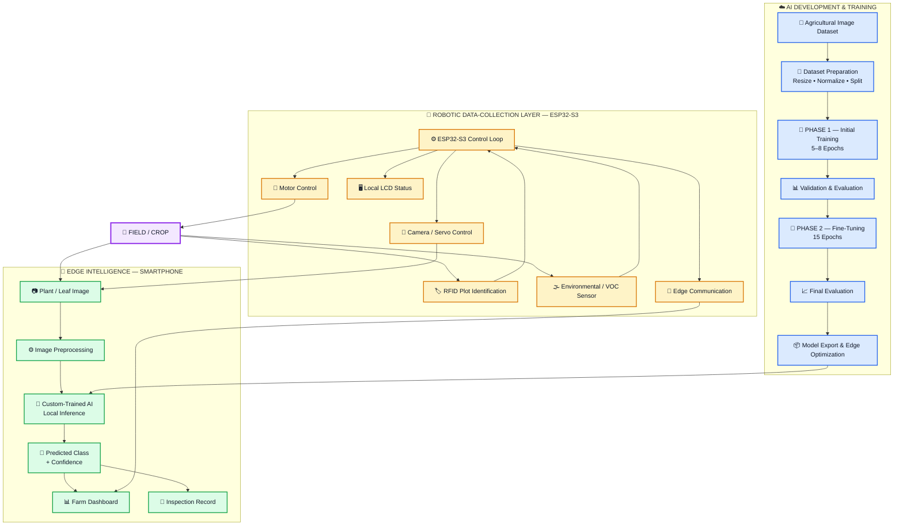
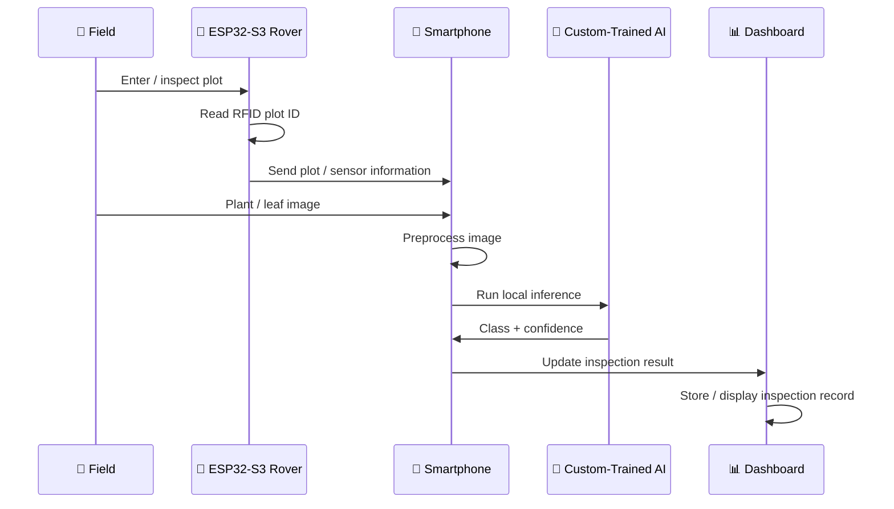
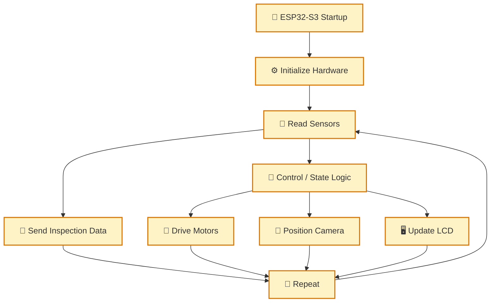
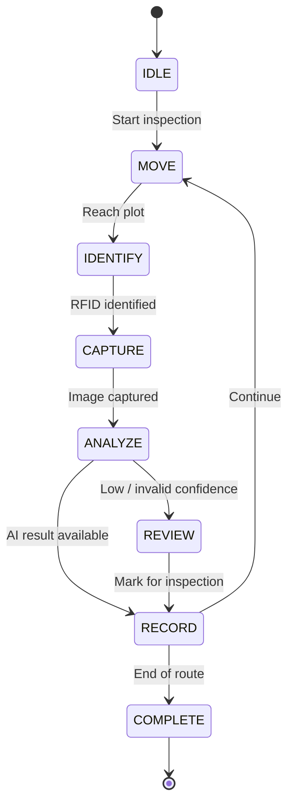

# 🏗️ EdgeCrop — System Architecture & System Robustness

> **EdgeCrop** is an edge-AI agricultural inspection rover designed to collect plant and environmental data in the field, identify the inspected plot, run a **custom-trained plant-health computer vision model locally on a smartphone**, and return a structured inspection result without depending on continuous cloud inference.

---

## 1. System Overview

EdgeCrop is intentionally divided into **three major layers**:

1. **AI Development Layer** — dataset preparation, training, evaluation, and optimization.
2. **Edge Intelligence Layer** — smartphone-based local AI inference and dashboard.
3. **Robotic Data-Collection Layer** — ESP32-S3 control, RFID plot identification, environmental sensing, movement, and local display.

This separation prevents the AI system from becoming tightly coupled to the robot controller.

### Core principle

```text
          TRAIN IN THE CLOUD
                  │
                  ▼
       Custom-Trained AI Model
                  │
        Export / Optimization
                  │
                  ▼
        DEPLOY TO SMARTPHONE
                  │
          LOCAL INFERENCE
                  │
                  ▼
      Inspection Result + Dashboard
                  ▲
                  │
        Data from ESP32-S3
                  ▲
                  │
        ┌─────────┴─────────┐
        │   AGRICULTURAL    │
        │   INSPECTION      │
        │      ROVER        │
        └───────────────────┘
```

---

# 2. High-Level Architecture



---

# 3. Custom AI Training Pipeline

The AI component is **not intended to be a generic pretrained classifier used directly on the rover**.

EdgeCrop uses a **custom-trained agricultural computer vision model**, trained using an agricultural image dataset and then prepared for deployment on the smartphone edge device.

## Training is divided into two explicit phases

### Phase 1 — Initial Training

**Training duration: 5–8 epochs**

The first phase establishes the model's initial ability to distinguish the target agricultural classes.

```text
Agricultural Dataset
        │
        ▼
Dataset Preparation
        │
        ▼
Model Initialization
        │
        ▼
┌─────────────────────────────┐
│ PHASE 1                     │
│ Initial Training            │
│                             │
│ 5–8 Epochs                  │
└─────────────────────────────┘
        │
        ▼
Validation
```

The Phase 1 process is used to establish a stable baseline before fine-tuning.

---

### Phase 2 — Fine-Tuning

**Fine-tuning duration: 15 epochs**

After the initial training stage, the model enters a dedicated fine-tuning stage.

```text
Phase 1 Model
      │
      ▼
Validation Results
      │
      ▼
┌─────────────────────────────┐
│ PHASE 2                     │
│ Fine-Tuning                 │
│                             │
│ 15 Epochs                   │
└─────────────────────────────┘
      │
      ▼
Final Validation
      │
      ▼
Optimized Edge Model
```

The purpose of Phase 2 is to refine the model's learned representation and improve its performance on the selected agricultural classes.

> **Important:** The exact accuracy, precision, recall, F1-score, loss curves, and confusion matrix will be added from the actual training run. They should not be claimed before the experiment is completed.

---

# 4. AI Development → Edge Deployment

The training environment and the final inference environment are deliberately separated.


### Why this matters

The smartphone does **not need to send every plant image to a remote AI service for prediction**.

Instead:

**Cloud / Colab**

- dataset preparation
- model training
- Phase 1 training
- Phase 2 fine-tuning
- evaluation
- model export

**Smartphone**

- image capture
- preprocessing
- model loading
- local inference
- confidence/result display
- inspection record

This creates a **cloud-trained → edge-deployed** workflow.

---

# 5. Complete Inspection Data Flow



---

# 6. Clear Responsibility Separation

| Component | Main Responsibility | Why It Is Separated |
|---|---|---|
| **Agricultural Dataset** | Provides training examples | Keeps training data separate from deployment |
| **Google Colab** | Model development and training | Training is computationally heavier |
| **Phase 1** | Initial model training | Establishes the first trained model |
| **Phase 2** | Fine-tuning for 15 epochs | Refines the trained model |
| **Optimized Model** | Deployment artifact | Designed for edge inference |
| **Smartphone** | AI inference + dashboard | Provides practical edge computing |
| **ESP32-S3** | Robot control | Keeps movement deterministic |
| **RFID** | Plot identification | Associates observations with a physical plot |
| **Environmental/VOC Sensor** | Supporting field information | Adds contextual sensor data |
| **LCD** | Local status | Provides a fallback display |
| **Motors** | Rover movement | Moves the inspection platform |
| **Servo** | Camera positioning | Controls inspection viewpoint |

---

# 7. Robot Control Architecture

The ESP32-S3 is responsible for the physical machine.



### Important design decision

The ESP32-S3 does **not** need to perform the full computer-vision model.

Its job is to reliably operate the physical system.

The smartphone performs the computationally heavier AI inference.

---

# 8. Robustness Strategy

EdgeCrop is designed so that failure of one subsystem does not automatically stop every other subsystem.

## 8.1 AI Failure

If the AI model cannot produce a valid prediction:

```text
Image
  │
  ▼
AI Inference
  │
  ├── Valid result ─────► Display result
  │
  └── Invalid / failed ─► Mark for manual inspection
```

The system should not present a failed or uncertain inference as a confirmed disease identification.

Recommended user-facing terminology:

- **Possible Disease / Condition**
- **Needs Further Inspection**
- **Low Confidence**
- **Healthy / No Detected Issue** only when supported by the trained class set

---

## 8.2 Communication Failure

The robot and smartphone are separate subsystems.

```text
ESP32-S3
   │
   │ communication available
   ▼
Smartphone
   │
   ▼
Dashboard

If communication is interrupted:

ESP32-S3 ─────► Continue safe robot control
   │
   └──────────► LCD shows local status
```

The robot should not depend on a successful dashboard update for every low-level motor-control operation.

---

## 8.3 Sensor Failure

Sensor readings should be treated as data that require validation.

Example logic:

```text
Read Sensor
     │
     ▼
Check Range / Validity
     │
 ┌───┴───────────────┐
 │                   │
Valid              Invalid
 │                   │
 ▼                   ▼
Use Value       Ignore / Flag
```

This prevents obviously invalid readings from being treated as reliable agricultural measurements.

---

## 8.4 Local Display Redundancy

The LCD provides a simple local interface.

Example:

```text
EDGE CROP
Plot: A-03
Status: SCANNING
VOC: 184
AI: READY
```

If the dashboard is temporarily unavailable, basic machine status can still be shown locally.

---

# 9. Inspection State Machine

The complete inspection process can be represented as:



### Operational sequence

**SCAN → IDENTIFY → CAPTURE → ANALYZE → RECORD → CONTINUE**

This keeps the inspection process understandable during both development and demonstration.

---

# 10. Low-Connectivity / Edge-First Operation

One of the main architectural goals is reducing dependence on continuous internet connectivity.

### During development

```text
Internet / Colab
       │
       ▼
Training + Evaluation
       │
       ▼
Export Model
```

### During field operation

```text
                 INTERNET
                    │
             NOT REQUIRED FOR
             EVERY INFERENCE
                    │
                    X

🌱 Field
  │
  ▼
📷 Image
  │
  ▼
📱 Smartphone
  │
  ▼
🧠 Local AI
  │
  ▼
📊 Result
```

The model is trained before deployment. The smartphone then acts as the edge inference device.

This is particularly relevant for agricultural environments where reliable high-speed connectivity cannot always be assumed.

---

# 11. System Robustness at a Glance

| Failure / Limitation | System Response |
|---|---|
| Internet unavailable | Local smartphone inference can continue after model deployment |
| AI result unavailable | Mark observation for further inspection |
| Low AI confidence | Do not treat prediction as a confirmed diagnosis |
| Dashboard communication interrupted | ESP32-S3 continues its local control functions |
| Sensor value invalid | Validate and flag / ignore invalid value |
| Smartphone unavailable | Robot can retain basic local control/status functions |
| LCD unavailable | Core robot control remains separate |
| Dataset performance insufficient | Retrain / fine-tune and evaluate before redeployment |

---

# 12. Performance Measurement

The final documentation should report **measured values from the actual implementation**, rather than estimated numbers.

Recommended measurements:

| Metric | Measurement to Add |
|---|---|
| Phase 1 training time | `[ADD ACTUAL VALUE]` |
| Phase 1 validation accuracy | `[ADD ACTUAL VALUE]` |
| Phase 2 validation accuracy | `[ADD ACTUAL VALUE]` |
| Precision | `[ADD ACTUAL VALUE]` |
| Recall | `[ADD ACTUAL VALUE]` |
| F1-score | `[ADD ACTUAL VALUE]` |
| Model size | `[ADD ACTUAL VALUE]` |
| Smartphone inference time | `[ADD ACTUAL VALUE]` |
| ESP32 sensor update time | `[ADD ACTUAL VALUE]` |
| Communication latency | `[ADD ACTUAL VALUE]` |
| Battery operating time | `[ADD ACTUAL VALUE]` |

---

# 13. Evidence & Screenshots

The final repository should include screenshots from the **actual implementation and training run**.

### AI Training Evidence

Add screenshots for:

- Dataset structure
- Phase 1 training
- Phase 1 loss / accuracy
- Phase 2 fine-tuning
- Phase 2 loss / accuracy
- Confusion matrix
- Classification report
- Final model/export process

Suggested folder:

```text
docs/
└── screenshots/
    ├── dataset.png
    ├── phase1-training.png
    ├── phase1-results.png
    ├── phase2-finetuning.png
    ├── phase2-results.png
    ├── confusion-matrix.png
    └── model-export.png
```

### Hardware Evidence

Add:

- complete rover photograph
- ESP32-S3 wiring
- RFID setup
- sensor setup
- camera setup
- LCD output
- smartphone dashboard

### Demonstration Evidence

Add:

- plot identification
- image capture
- local AI inference
- result display
- inspection record
- complete rover workflow

> Screenshots and measured values should be added only after the corresponding feature has actually been tested.

---

# 14. Third-Party Resources & AI Documentation

The project repository should explicitly document external resources used during development.

For every external dataset, pretrained base model, library, framework, or significant AI-assisted development contribution, record:

```text
Resource:
Purpose:
Source:
License:
How it was used:
What was modified:
```

For AI development, also document the actual training configuration, including:

```text
Dataset:
Model architecture / base model:
Image size:
Classes:
Phase 1 epochs: 5–8
Phase 2 epochs: 15
Optimizer:
Learning rate:
Batch size:
Augmentation:
Validation method:
Export format:
```

The exact values should match the actual experiment.

---

# 15. Why the Architecture Is Robust

EdgeCrop avoids putting every function into one controller.

### AI is separated from robot control

The smartphone handles computer vision while the ESP32-S3 handles physical control.

### Training is separated from inference

Google Colab is used for model development, while the trained model is exported for smartphone inference.

### The training process is staged

The model goes through:

**Phase 1 — 5–8 epochs initial training**

↓

**Validation**

↓

**Phase 2 — 15 epochs fine-tuning**

↓

**Final evaluation**

↓

**Edge deployment**

### Physical and digital systems are separated

A dashboard problem should not automatically become a motor-control problem.

### Local operation is prioritized

After deployment, the AI inference pipeline is designed to operate locally on the smartphone rather than requiring a cloud API for every image.

---

# 16. Final Architecture Summary

```text
                    EDGE CROP
                        │
        ┌───────────────┴────────────────┐
        │                                │
        ▼                                ▼
   AI DEVELOPMENT                  ROBOT PLATFORM
        │                                │
        ▼                                ▼
Agricultural Dataset               ESP32-S3
        │                                │
        ▼                                ├── Motors
Phase 1: 5–8 Epochs                     ├── Servo
        │                                ├── RFID
        ▼                                ├── Sensors
Phase 2: 15 Epochs                       └── LCD
        │
        ▼
Final Evaluation
        │
        ▼
Optimized Model
        │
        ▼
   📱 SMARTPHONE
        │
        ├── Camera
        ├── Local AI Inference
        ├── Confidence
        ├── Dashboard
        └── Inspection Records
```

---

## Engineering Principle

> **Train centrally, deploy locally, collect data physically, and keep the robot controller independent from the AI inference pipeline.**

That architecture allows EdgeCrop to combine **custom-trained AI, edge computing, robotics, agricultural sensing, and structured inspection records** into one practical system while keeping the major subsystems understandable, testable, and replaceable.
