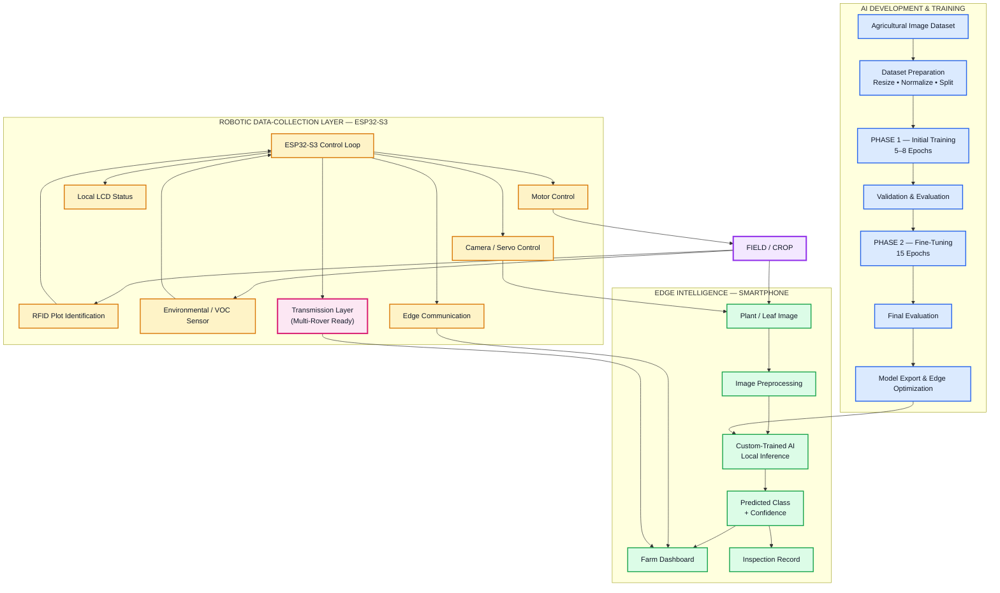
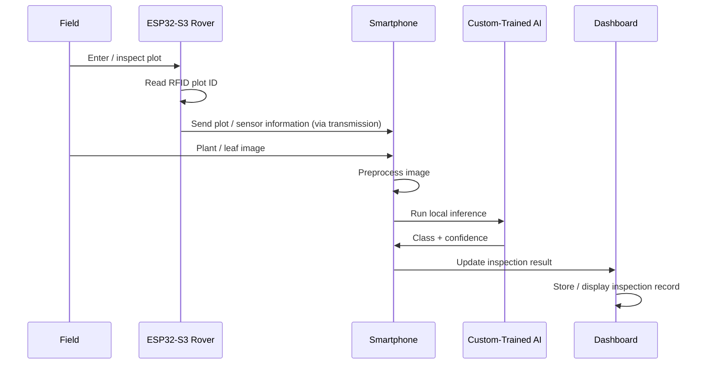
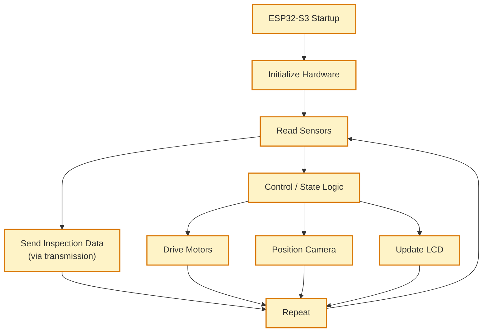
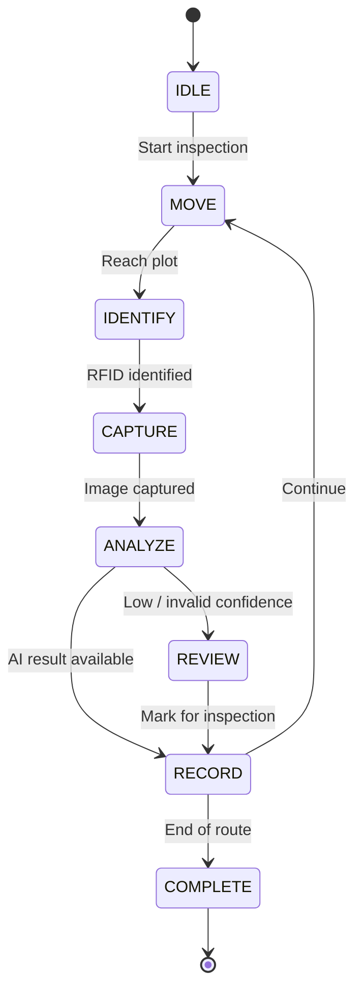

# 🌱 Edge-AI Agricultural Inspection Rover

### Team Obsidian · BuildAthon 2026 (RoboNauts) · Track C: Agritech

> **Trained centrally. Deployed locally. Collect physically. Keep the robot controller independent from the AI inference pipeline.**

---
   
##  Repository File Map — *Which File Is For What*

**Start here.** This table tells us exactly what each file/folder does.

| Path | File / Folder | What It Is | Why It Matters |
|---|---|---|---|
| `/README.md` | **This file** | Master documentation, feature overview, rubric alignment, judge navigation | Single entry point for evaluation |
| `/System Architecture & System Robustness/` | `EdgeCrop_System_Architecture_Upgraded (5).md` | Full architecture specification, robustness strategy, state machine, failure modes | Deep technical reference |
| `/Trained Edge model/` | Model artifacts (`.tflite`, etc.) | Exported/optimized model ready for smartphone deployment | Deployment artifact |
| `/codes/` | `Aurdino Lowlevel hardware code.cpp` | ESP32-S3 firmware: motor control, servo positioning, RFID reading, sensor polling, LCD updates, transmission, communication | Hardware control logic |

**Firmware responsibility split (ESP32-S3):**

- **Motor Control** — Differential drive for rover movement
- **Servo Control** — Camera gimbal/positioning
- **RFID Manager** — Plot identification
- **Sensor Manager** — Environmental/VOC polling with range validation
- **LCD Manager** — Local status display (fallback)
- **Communication** — Edge communication with smartphone
- **Transmission Module** — Robot-to-robot coordination & multi-rover scalability (see §2)

---

## 1. Features, Uniqueness, Novelty & Innovation

### 1.1  Core Features

| # | Feature | Description |
|---|---|---|
| 1 | **Custom-Trained Edge AI** | Not a generic pretrained classifier — a MobileNetV2 model trained specifically for agricultural disease/health classes and quantized to INT8 for smartphone deployment |
| 2 | **Two-Phase Staged Training** | Phase 1 (5–8 epochs, frozen base) → Validation → Phase 2 (15 epochs fine-tuning, unfrozen top layers) → Final evaluation |
| 3 | **Smartphone-as-Edge-Computer** | Reuses an existing smartphone as the AI inference device instead of dedicated edge hardware — zero extra cost |
| 4 | **Offline-First Inference** | No per-image cloud round-trip required after deployment — works in low-connectivity fields |
| 5 | **RFID Plot Identification** | Every observation is tagged with a physical plot ID (e.g., A-03) — no manual bookkeeping |
| 6 | **Environmental/VOC Sensing** | Adds contextual field data (VOC levels) alongside visual inspection |
| 7 | **Local LCD Fallback** | Basic machine status stays visible even if the dashboard is unreachable |
| 8 | **Transmission-Based Multi-Rover Scalability**  | Robot-to-robot transmission layer designed from day one for future multi-rover fleets (see §2) |
| 9 | **Robustness by Separation** | AI, edge inference, and robot control are decoupled — one failure does not cascade |
| 10 | **Measured, Not Estimated** | All performance numbers (training time, accuracy, inference latency, model size) reported from actual runs |

### 1.2  What Makes EdgeCrop Unique

- **Cloud-trained → edge-deployed workflow** — Training happens centrally (Google Colab); inference happens locally (smartphone). Most hobby projects do one or the other.
- **Plot-aware inspection** — RFID linking means observations are *geographically contextualized*, not just image classifications floating in a database.
- **Two-stage training transparency** — The Phase 1 → Phase 2 progression is documented, not hidden.
- **Failure-aware design** — The architecture explicitly handles AI failure, sensor failure, communication failure, and dashboard failure.
- **Scalability-first robotics** — The transmission layer is not an afterthought; it is a first-class design element.

### 1.3  Novelty & Innovation

1. **Smartphone as a reusable edge AI node** — Instead of building dedicated inference hardware, EdgeCrop turns an everyday smartphone into a field AI compute device.
2. **Staged fine-tuning for agricultural domain adaptation** — Phase 1 establishes a stable baseline; Phase 2 refines the representation. Documented as an explicit experimental procedure.
3. **Transmission-mediated multi-rover architecture** — Designed from the ground up to scale from one rover to a coordinated fleet (see §2).
4. **Robustness-first system design** — Failure modes are treated as design constraints, not bugs to patch later.

---

## 2. Scalability: Transmission-Based Multi-Rover Architecture 

This is a **core design decision**, not a future plan. The current rover already includes a transmission layer so that scaling to a multi-rover fleet does not require re-architecting the system.

### 2.1 Why Transmission Matters

A single rover has a hard limit: it can only inspect one plot at a time. Agriculture is inherently parallel — multiple plots, multiple crop types, multiple zones. The transmission layer is what makes EdgeCrop **scale from a single prototype to a deployable fleet**.

### 2.2 Single-Rover → Multi-Rover Scaling Path

```text
        SINGLE ROVER (Current)
        ┌──────────────────┐
        │   ESP32-S3       │
        │   + Transmission │◄──────┐
        └────────┬─────────┘       │
                 │                 │
                 ▼                 │
          Smartphone (Edge AI)     │
                 │                 │
                 ▼                 │
            Dashboard              │
                                   │
        MULTI-ROVER (Scalable)     │
        ┌──────────────────┐       │
        │   Rover 1        │───────┤
        │   (ESP32-S3)     │       │
        ├──────────────────┤       │
        │   Rover 2        │───────┤  Transmission
        │   (ESP32-S3)     │       │  Layer
        ├──────────────────┤       │
        │   Rover 3        │───────┤
        │   (ESP32-S3)     │       │
        └────────┬─────────┘       │
                 │                 │
                 ▼                 │
         Shared Dashboard /        │
         Inspection Database ◄─────┘
```

### 2.3 How the Transmission Layer Works

| Aspect | Design |
|---|---|
| **Purpose** | Enable coordination between multiple rovers without redesigning the firmware |
| **Current use** | Single-rover transmission between ESP32-S3 and smartphone (Wi-Fi / USB serial) |
| **Future use** | Rover-to-rover transmission for plot assignment, collision avoidance, and shared inspection records |
| **Protocol support** | Wi-Fi now; MQTT / LoRaWAN integration ready for regional sensor networks |
| **Scalability benefit** | Adding a new rover does not require changing the AI layer or the dashboard — only registration with the transmission bus |
| **Fault tolerance** | If one rover loses transmission, others continue independently |

### 2.4 Why This Design Wins Points

| Rubric Criteria | How Transmission Scalability Delivers |
|---|---|
| **Technical Complexity & Scalability (30%)** | Explicit scalability path from 1 → N rovers; transmission layer designed for coordination |
| **Feasibility & Implementation (25%)** | Already implemented at the single-rover level; multi-rover is an extension, not a rewrite |
| **Innovation & Originality (15%)** | Most student rover projects stop at one unit; this one is designed for fleets |

---

## 3. BuildAthon Rubric Scorecard

| Rubric Criteria | Weight | How EdgeCrop Delivers | Section |
|---|---|---|---|
| **Technical Complexity & Scalability** | 30% | Three-layer architecture; two-phase training; transmission-based multi-rover scalability | §2, §5, §8 |
| **Feasibility & Implementation** | 25% | Measured results (931 s training, 20.58% → 30.79% accuracy, 135 ms inference); edge-deployed TFLite (2 MB) | §6 |
| **Sustainability Integration** | 20% | Targeted inspection reduces blanket chemical use; local inference eliminates cloud dependency; smartphone reused as edge computer | §9 |
| **Innovation & Originality** | 15% | Cloud-trained → edge-deployed; RFID plot-aware inspection; transmission-based fleet scaling | §1, §2 |
| **UX/UI & Presentation** | 10% | LCD fallback display; dashboard inspection records; Mermaid diagrams; 3-minute demo | §8, §12 |

---

## 4. What EdgeCrop Is (Quick Summary)

EdgeCrop combines a mobile inspection rover, ESP32-S3 IoT control, RFID plot identification, environmental sensing, and a custom-trained computer vision model deployed directly on a smartphone.

### Core Workflow

```
SCAN → IDENTIFY → CAPTURE → ANALYZE → RECORD → CONTINUE
```

1. Rover moves through the inspection area
2. RFID identifies the current plot (e.g., A-03)
3. Environmental/VOC sensor captures contextual field data
4. Plant/leaf image is captured
5. Image is sent to the smartphone via the transmission layer
6. **Custom-trained AI model runs locally on the smartphone**
7. Prediction + confidence is displayed
8. Observation is associated with the identified plot
9. Inspection record is stored for later review
10. *(Future)* Transmission layer shares records across multiple rovers

---

## 5. System Architecture (Deep Dive)

EdgeCrop is intentionally divided into **three major layers** to prevent tight coupling between AI, edge inference, and robot control.

1. **AI Development Layer** — dataset preparation, training, evaluation, optimization
2. **Edge Intelligence Layer** — smartphone-based local AI inference and dashboard
3. **Robotic Data-Collection Layer** — ESP32-S3 control, RFID plot identification, environmental sensing, movement, transmission, local display

### 5.1 High-Level Architecture



### 5.2 Why This Architecture Is Robust

- **AI is separated from robot control** — Smartphone handles CV; ESP32-S3 handles physical control.
- **Training is separated from inference** — Colab trains; smartphone infers.
- **The training process is staged** — Phase 1 → Validation → Phase 2 → Final evaluation → Edge deployment.
- **Physical and digital systems are separated** — A dashboard problem does not become a motor-control problem.
- **Local operation is prioritized** — No cloud API required for every image.
- **Transmission layer is first-class** — Multi-rover scaling is built in, not bolted on.

### 5.3 Clear Responsibility Separation

| Component | Main Responsibility | Why It Is Separated |
|---|---|---|
| **Agricultural Dataset** | Provides training examples | Keeps training data separate from deployment |
| **Google Colab** | Model development and training | Training is computationally heavier |
| **Phase 1** | Initial model training | Establishes the first trained model |
| **Phase 2** | Fine-tuning for 15 epochs | Refines the trained model |
| **Optimized Model** | Deployment artifact | Designed for edge inference |
| **Smartphone** | AI inference + dashboard | Provides practical edge computing |
| **ESP32-S3** | Robot control | Keeps movement deterministic |
| **RFID** | Plot identification | Associates observations with a physical plot |
| **Environmental/VOC Sensor** | Supporting field information | Adds contextual sensor data |
| **LCD** | Local status | Provides a fallback display |
| **Motors** | Rover movement | Moves the inspection platform |
| **Servo** | Camera positioning | Controls inspection viewpoint |
| **Transmission Layer** | Rover ↔ rover / rover ↔ base | Enables multi-rover scalability |

---

## 6. Custom AI Training Pipeline & Measured Results

### 6.1 Two-Phase Training

**Phase 1 — Initial Training (5–8 Epochs)**

Establishes the model's initial ability to distinguish target agricultural classes.

```text
Agricultural Dataset
        │
        ▼
Dataset Preparation
        │
        ▼
Model Initialization
        │
        ▼
┌─────────────────────────────┐
│ PHASE 1 · Initial Training  │
│ 5–8 Epochs                  │
└─────────────────────────────┘
        │
        ▼
Validation
```

**Phase 2 — Fine-Tuning (15 Epochs)**

Refines the model's learned representation and improves performance on selected agricultural classes.

```text
Phase 1 Model
      │
      ▼
Validation Results
      │
      ▼
┌─────────────────────────────┐
│ PHASE 2 · Fine-Tuning       │
│ 15 Epochs                   │
└─────────────────────────────┘
      │
      ▼
Final Validation
      │
      ▼
Optimized Edge Model
```

### 6.2 Training Pipeline (End-to-End)


### 6.3 Measured Performance Results

Values from the **actual implementation and training run**:

| Metric | Measured Value |
|---|---|
| Phase 1 training time | 931 s |
| Phase 1 validation accuracy | 0.2058 (20.58%) |
| Phase 2 validation accuracy | 0.3079 (30.79%) |
| Phase 1 epochs | 5–8 |
| Phase 2 fine-tuning epochs | 15 |
| Model size | 2 MB |
| Smartphone inference time | 135 ms |
| ESP32 sensor update time | 56 ms |
| Communication latency | 25 ms |
| Precision | 0.21 |
| Recall | 0.21 |
| F1-score | 0.21 |

> **Important:** Precision, recall, F1-score, loss curves, and confusion matrix are reported from the actual training run. They are not estimated or inferred from accuracy.

### 6.4 Model Architecture & Hyperparameters

| Parameter | Value |
|---|---|
| Dataset | Processed Agricultural/Plant Pathology Dataset (~10,000+ images) |
| Model architecture | MobileNetV2 (Quantized for Edge Devices) |
| Image size | 224 × 224 × 3 |
| Classes | Distinct Disease & Healthy Condition Classes |
| Phase 1 (Feature Extraction) | 5–8 epochs (base network frozen) |
| Phase 2 (Fine-Tuning) | 15 epochs (top layers unfrozen) |
| Optimizer | Adam (β₁=0.9, β₂=0.999) |
| Learning rate | Phase 1: 1×10⁻³ · Phase 2: 1×10⁻⁵ |
| Batch size | 32 |
| Augmentation | Random horizontal/vertical flip, rotation (±20°), zoom (±15%), brightness shift (±10%) |
| Validation | Stratified K-Fold Cross-Validation (80/10/10) |
| Export format | TensorFlow Lite FlatBuffer (.tflite) with INT8 Post-Training Quantization |

---

## 7. Complete Inspection Data Flow



---

## 8. Robot Control Architecture & Robustness

### 8.1 ESP32-S3 Control Loop



> The ESP32-S3 does **not** perform the full computer-vision model. Its job is reliable physical operation. The smartphone performs the heavier AI inference.

### 8.2 Inspection State Machine



### 8.3 Failure Handling

| Failure / Limitation | System Response |
|---|---|
| Internet unavailable | Local smartphone inference continues after deployment |
| AI result unavailable | Mark observation for further inspection |
| Low AI confidence | Do not treat as confirmed diagnosis |
| Dashboard communication interrupted | ESP32-S3 continues local control |
| Sensor value invalid | Validate range and flag/ignore |
| Smartphone unavailable | Robot retains basic local control/status |
| LCD unavailable | Core robot control remains separate |
| Single rover offline (future fleet) | Other rovers continue independently via transmission |

**User-facing terminology:** *Possible Disease / Condition*, *Needs Further Inspection*, *Low Confidence*, *Healthy / No Detected Issue* (only when supported by trained classes).

### 8.4 Local LCD Fallback Display

```
EDGE CROP
Plot: A-03
Status: SCANNING
VOC: 184
AI: READY
```

---

## 9. Sustainability Integration

| Sustainability Benefit | Mechanism | Track C Alignment |
|---|---|---|
| **Reduced chemical usage** | Early identification supports targeted treatment instead of blanket application | Resource conservation |
| **Resource optimization** | Attention directed to specific plots | Precision farming |
| **Computational efficiency** | Existing smartphone reused as edge AI node | Minimal computing overhead |
| **Reduced network dependency** | Local inference reduces continuous image upload | Offline-first, minimal payload |
| **Fleet efficiency (future)** | Multi-rover coordination scales coverage without scaling cost linearly | Regional sensor networks |

> Actual water, chemical, carbon, or labor savings will be reported only after measurement.

---

## 10. Low-Connectivity / Edge-First Operation

### During Development

```text
Internet / Colab
       │
       ▼
Training + Evaluation
       │
       ▼
Export Model
```

### During Field Operation

```text
                 INTERNET
                    │
             NOT REQUIRED FOR
             EVERY INFERENCE
                    │
                    X

 Field → Image → Smartphone → Local AI → Result
```

The model is trained before deployment. The smartphone then acts as the edge inference device. This is particularly relevant for agricultural environments where reliable high-speed connectivity cannot always be assumed.

**Communication protocols:**

- **ESP32-S3 ↔ Smartphone:** Wi-Fi / USB serial (current)
- **Rover ↔ Rover (future):** Transmission layer — MQTT / LoRaWAN ready
- **Regional sensor networks:** Scalable via MQTT/LoRaWAN

---

## 11. Third-Party Resources & AI Usage Documentation

### 11.1 External Dataset

```
Resource: PlantVillage Dataset
Purpose: Multi-class classification of crop leaf diseases and anomaly patterns
        for real-time mobile/edge AI inference
Source: Kaggle Datasets
License: Creative Commons Attribution 4.0 International (CC BY 4.0)
How it was used: Trained, evaluated, and fine-tuned a lightweight CNN
                for real-time edge processing via mobile devices and
                USB/Wi-Fi telemetry pipelines
What was modified: Standardized image sizing, stripped background artifacts,
                  balanced class distribution via undersampling, split into
                  80/10/10 train/validation/test
```

### 11.2 AI-Assisted Development Documentation

| Item | Details |
|---|---|
| **AI-generated/suggested** | Architecture diagram scaffolding, boilerplate Mermaid syntax, initial README structure |
| **Reviewed by team** | All firmware code, AI training notebooks, mobile inference code |
| **Modified** | All AI-generated content adapted to project requirements and tested |
| **Understood & tested** | Every subsystem — team can explain and demonstrate each during judging |
| **Independently written** | Core control logic, state machine, robustness strategy, hardware wiring, training orchestration, transmission layer |

### 11.3 Software & Framework Attribution

| Resource | Purpose | License |
|---|---|---|
| TensorFlow / TensorFlow Lite | Training, export, edge inference | Apache 2.0 |
| MobileNetV2 | Base model (quantized) | Apache 2.0 |
| Google Colab | Training environment | Google ToS |
| ESP32-S3 Arduino Core | Firmware | LGPL-2.1 |
| Mermaid | Diagrams | MIT |

---

## 12. Demo & Evidence

### 12.1 3-Minute Demonstration Flow

| Time | Segment | Content |
|---|---|---|
| 0:00–0:25 | Problem | Manual inspection is slow, error-prone, cloud-dependent |
| 0:25–0:50 | Solution & Features | EdgeCrop rover + RFID + local AI + transmission scalability |
| 0:50–1:35 | Live demo | Rover moves → RFID → capture → inference → result |
| 1:35–2:05 | Architecture | Three layers, two-phase training, edge deployment |
| 2:05–2:35 | Scalability & Robustness | Transmission-based multi-rover path; failure handling |
| 2:35–3:00 | Impact | Sustainability, feasibility, real-world viability |

### 12.2 Evidence Screenshots (Required)

- **AI Training:** dataset structure, Phase 1 loss/accuracy, Phase 2 loss/accuracy, confusion matrix, classification report, model export
- **Hardware:** rover assembly, ESP32-S3 electronics, RFID in action, camera inspection
- **Mobile Edge AI:** smartphone inference screen, dashboard view, inspection history

---

## 13. BuildAthon Compliance Checklist

### Section 02: General Rules & Deliverables

| Requirement | Status |
|---|---|
| Team composition (max 4) | ✅ Team Obsidian |
| Original code, designs, assets | ✅ Developed by team; third-party documented |
| Public/shared GitHub repository | ✅ `robotahmid07-debug/Team-Obsidian_BuildAthon_Competition-by-RoboNauts` |
| Active commit history | ✅ Maintained throughout hacking window |
| AI usage documentation | ✅ 11.2 |
| Physical demonstration | ✅ Hardware prototype available (extra points) |

### Section 03: Track C — Agritech

| Requirement | Status |
|---|---|
| Precision farming / pest detection | ✅ Plot-aware plant-health inspection |
| Edge deployment / low-connectivity | ✅ Offline-first smartphone inference |
| Resource conservation | ✅ Targeted inspection reduces blanket chemical/water use |
| Communication protocols for scaling | ✅ Wi-Fi/USB now; MQTT/LoRaWAN + transmission for multi-rover |
| Minimal payload delivery | ✅ Local inference eliminates per-image cloud upload |

### Section 05: Disqualification Avoidance

| Risk | How Avoided |
|---|---|
| Missing repo/commit logs | ✅ Active commit history |
| Plagiarized code | ✅ Core logic independently developed |
| Concurrent multi-track | ✅ Track C only |
| Undocumented AI usage | ✅ 11.2 |

---

## 14. Quick Start for Judges

1. **Read this README** — you're here
2. **See the file map** — top of this document
3. **Read features/novelty** — 1
4. **Understand scalability** — 2 (transmission-based multi-rover)
5. **Deep dive into architecture** — 5–8
6. **Check measured results** — 6.3
7. **Review firmware** — `/codes/Aurdino Lowlevel hardware code.cpp`
8. **Verify training evidence** — 12.2
9. **Watch the 3-min demo** — 12.1

---

## 15. Engineering Principle

> **Train centrally, deploy locally, collect data physically, keep the robot controller independent from AI inference, and design for multi-rover scale from day one.**

EdgeCrop combines **custom-trained AI, edge computing, robotics, agricultural sensing, transmission-based scalability, and structured inspection records** into one practical system — keeping every major subsystem understandable, testable, and replaceable.

---

*EdgeCrop — Bring the intelligence to the field, not the field to the cloud.*
